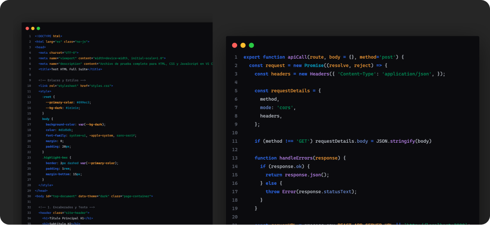

<h1 id="top" align="center">
  
  Aesthetic theme
</h1>

 

<pre align="center">
  <a href="#requirements">⚡ REQUIREMENTS</a> • <a href="#usage">🚀 USAGE</a>
</pre>

 

 

  

<h2 id="about">
  
  About
</h2>

<table border="0">
<tr>
<td>
A meticulously crafted, high-contrast dark theme designed for developers who value visual harmony, reduced eye strain, and a distraction-free coding environment.

Every color and syntax token in this theme has been thoughtfully balanced to highlight core logic without causing visual fatigue during long coding sessions. Whether you are building full-stack web applications, tweaking configuration files, or diving deep into system architecture, Aesthetic Theme provides a clean, modern palette that lets your code take center stage.
</td>
</tr>
</table>

 

<h2 id="table-of-content">
  
  Table of content
</h2>

- [ About](#about)
- [ Requirements](#requirements)
- [ Usage](#usage)

<h2 id="requirements">
  
  Requirements
</h2>

-  vscode >= **1.125.0**
-  node >= **22.17.0**
-  bun >= **1.1.0**

 

<h2 id="usage">
  
  Usage
</h2>

To use the Aesthetic Theme in Visual Studio Code, follow these steps:

1. Open Visual Studio Code.
2. Go to the Extensions view by clicking on the Extensions icon in the Activity Bar on the side of the window.
3. Search for "Aesthetic Theme".
4. Click "Install" to add the theme to your editor.
5. Once installed, go to the Color Theme picker by pressing `Ctrl+K Ctrl+T` (or `Cmd+K Cmd+T` on macOS) and select "Aesthetic Theme" from the list.

 

<pre align="center">
  <a href="#top">BACK TO TOP</a>
</pre>

<pre align="center">
  Copyright © All rights reserved,
  developed by LuisdaByte and
</pre>

  

